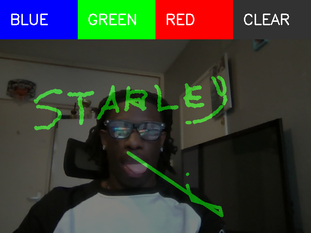

# Air Drawing – Software Life Cycle Document (SLDC)

**Naam:** Air Drawing  
**Repository:** [Starley-iggy/air-drawing](https://github.com/Starley-iggy/air-drawing)  
**Taal:** Python  
**Maker:** Starley Igbinomwhaia Briggs

## Doel
Air Drawing is een interactieve applicatie die gebruikers in staat stelt te tekenen in de lucht met hun hand, via een webcam en realtime handtracking. Het systeem detecteert de hand en vertaalt bewegingen van de wijsvinger naar lijnen op een digitaal canvas.

## Scope

**Inclusief:**  
- Realtime tekenen  
- Kleurselectie  
- Canvas wissen  
- Handtracking via Mediapipe  

**Exclusief:**  
- Opslaan van tekeningen  
- Meerdere brush types  
- Multi-hand tracking (voor toekomstige uitbreiding)  

## Doelgroep / Stakeholders

**Primair:** hobbyisten, studenten en makers die experimenteren met computer vision en interactieve projecten.  

**Secundair:** docenten, demonstraties in educatieve context, creatieve prototypes.  

---

## 2. Projectdoelstellingen

| Doelstelling             | Beschrijving                                                        |
|---------------------------|-------------------------------------------------------------------|
| Realtime handtracking     | Detecteer handlandmarks en volg de indexvinger nauwkeurig.        |
| Intuïtief tekenen         | Gebruiker kan eenvoudig tekenen door de lucht te bewegen.         |
| Interactie via UI-zones   | Kleuren en canvas wissen via handbewegingen.                      |
| Responsief en lichtgewicht| Laag latency, minimale vertraging bij tekenbewegingen.            |
| Eenvoudige uitbreidbaarheid | Ondersteuning voor extra features in toekomst (brushes, opslaan). |

---

## 3. Functioneel Ontwerp

### 3.1 Hoofdfunctionaliteiten

| Functionaliteit           | Beschrijving                                                      |
|---------------------------|-------------------------------------------------------------------|
| Handdetectie               | Detecteert handlandmarks via Mediapipe.                           |
| Tekenmodus                 | Teken alleen als indexvinger boven middelvinger is.               |
| Kleurselectie              | Bovenaan scherm: vier zones (Blue, Green, Red, Clear).            |
| Wis canvas                 | Wis het volledige canvas bij aanraking van Clear zone.            |
| Realtime visualisatie      | Canvas en webcamfeed worden samengevoegd en realtime weergegeven.|

### 3.2 Use Case Diagram
*(Diagram is niet ondersteund in Markdown)*

**Use Cases:**  
1. **Detect Hand** – Applicatie herkent de hand in beeld.  
2. **Select Color** – Gebruiker beweegt wijsvinger naar gewenste kleurzone.  
3. **Draw on Canvas** – Beweging van de wijsvinger wordt vertaald naar lijnen.  
4. **Clear Canvas** – Wis functie via Clear zone.  

### 3.3 Niet-functionele eisen

| Eisen         | Beschrijving                                                   |
|---------------|---------------------------------------------------------------|
| Performance   | Minimaal 15–30 FPS voor vloeiende realtime ervaring.          |
| Compatibiliteit | Python 3.7+, OpenCV en Mediapipe geïnstalleerd.            |
| Usability     | Eenvoudige interface met duidelijke zones voor kleuren/wissen.|
| Stabiliteit   | Foutafhandeling bij afwezigheid van hand of slechte belichting.|

---

## 4. Technisch Ontwerp

### 4.1 Architectuur
*(High-level overzicht van modules & datastromen)*

### 4.2 Modules & Verantwoordelijkheden

| Module                        | Functie                                        |
|-------------------------------|-----------------------------------------------|
| cv2.VideoCapture              | Leest webcam frames.                           |
| mediapipe.solutions.hands     | Detecteert handlandmarks.                     |
| mp.solutions.drawing_utils    | Teken handlandmarks op frame.                 |
| Canvas (numpy array)          | Slaat lijnen en tekendata op.                 |
| UI zones                       | Detecteert kleur- of wisselecties.            |
| Main loop                      | Verwerkt frames, detecteert hand, tekent, combineert en toont output.|

### 4.3 Pseudocode

```python
start webcam
initialize mediapipe hands
initialize empty canvas

while webcam active:
    read frame
    flip frame for mirror effect
    detect hand landmarks
    if hand detected:
        get index and middle finger positions
        if index above middle:
            draw line from previous position
        else:
            reset previous position
    check color zones (Blue, Green, Red, Clear)
    overlay canvas on frame
    show frame in fullscreen
    if ESC pressed: break
```


## 5. Gebruikersinterface

Canvas & UI Zones:

Horizontale balk bovenaan met zones: Blue | Green | Red | Clear

Gebruiker kiest kleur door wijsvinger in zone te bewegen

Canvas overlay op webcam feed voor realtime feedback

Handlandmarks zichtbaar voor gebruikersfeedback

### Mockup:
```
╔══════════════════════════════════════╗
║ Blue │ Green │ Red │ Clear           ║
╠══════════════════════════════════════╣
║                                      ║
║  ╔══════════════════════════════╗    ║
║  ║      Canvas + Webcam         ║    ║
║  ╚══════════════════════════════╝    ║
║                                      ║
╚══════════════════════════════════════╝
```
### Demo




## 6. Teststrategie

Testtype

Beschrijving

**Unit tests**	Test individuele functies zoals lijntekenen, kleurselectie.

**Integratietests**	Test volledige loop: webcam → handdetectie → canvas overlay.

**Performance tests**	Meet FPS en latency bij verschillende belichting en achtergrond.

**User Acceptance**	Feedback van primaire doelgroep over gebruiksgemak en intuïtiviteit.

## 7. Mogelijke uitbreidingen

Opslaan van tekeningen als .png

Meerdere brushes en diktes

GUI knoppen in plaats van zones

Multi-hand tracking

Gesture control voor extra functies

## 8. Conclusie

Air Drawing combineert handtracking, realtime beeldverwerking en interactieve UI tot een lichtgewicht Python-app. Het biedt een intuïtieve en creatieve ervaring voor gebruikers die willen tekenen in de lucht en vormt een solide basis voor toekomstige uitbreidingen.
